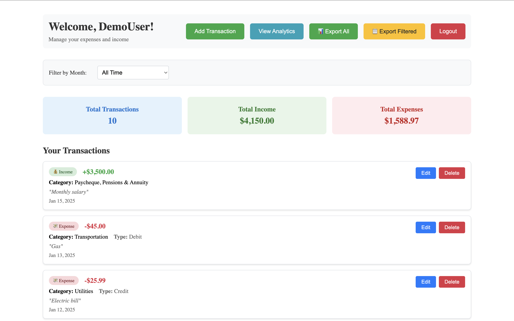
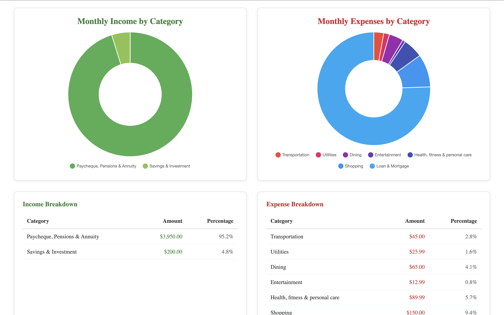

# 💰 Expense Tracker

A full-stack web application for managing personal finances with income and expense tracking, analytics, and data export capabilities.

## [Live Demo](https://finbud2.onrender.com/)

## Screenshots

### Dashboard Overview


### Analytics & Charts


### **Dashboard**
- **Transaction Management**: Add, edit, and delete income/expense transactions
- **Real-time Statistics**: View total income, expenses, and net balance
- **Monthly Filtering**: Filter transactions by specific months
- **Quick Actions**: Easy access to add transactions and view analytics
- **Responsive Design**: Works seamlessly on desktop and mobile devices

### **Analytics**
- **Visual Charts**: Interactive doughnut charts for income and expense breakdowns by category
- **Monthly Overview**: Bar charts showing monthly income vs expenses
- **Category Analysis**: Detailed breakdown tables with percentages
- **Year-over-Year**: Compare data across different years
- **Export Capabilities**: Download filtered or complete transaction data as CSV

### **Authentication**
- **JWT-based Authentication**: Secure, stateless authentication system
- **User Registration**: Create new accounts with email and password
- **Persistent Login**: Stay logged in across browser sessions
- **Automatic Logout**: Token expiration handling with automatic redirect
- **Password Security**: Bcrypt hashing for secure password storage

### **Data Management**
- **CSV Export**: Export all transactions or filtered data
- **Data Persistence**: MongoDB for reliable data storage
- **Real-time Updates**: Immediate UI updates when data changes
- **Data Validation**: Server-side validation for all inputs

## 🛠️ Technology Stack

### **Frontend**
- **React 18**: Modern React with hooks and functional components
- **React Router**: Client-side routing for SPA navigation
- **Chart.js**: Interactive charts and data visualization
- **Vite**: Fast build tool and development server
- **CSS-in-JS**: Inline styles for component styling

### **Backend**
- **Node.js**: JavaScript runtime environment
- **Express.js**: Web application framework
- **MongoDB**: NoSQL database for data storage
- **Mongoose**: MongoDB object modeling for Node.js
- **JWT**: JSON Web Tokens for authentication
- **Bcrypt**: Password hashing and security


### **Prerequisites**
- Node.js (v16 or higher)
- MongoDB (local or Atlas)
- Git

### **Installation**

1. **Clone the repository:**
```bash
git clone https://github.com/u-khang/finbud2.git
cd expense-tracker
```

2. **Backend Setup:**
```bash
cd backend
npm install
cp env.example .env
# Edit .env with your MongoDB URI and JWT secret
npm start
```

3. **Frontend Setup:**
```bash
cd frontend
npm install
cp env.example .env
# Edit .env with your API base URL
npm run dev
```

### **Environment Variables**

**Backend (.env):**
```env
PORT=4000
NODE_ENV=development
MONGO_URI=mongodb://localhost:27017/expense-tracker
SESSION_SECRET=your-super-secret-jwt-key
FRONTEND_URL=http://localhost:5173
ALLOWED_ORIGINS=http://localhost:5173,http://localhost:3000
```

**Frontend (.env):**
```env
VITE_API_BASE_URL=http://localhost:4000
```


### **Scripts**

**Backend:**
```bash
npm start              # Start production server
npm run seed           # Seed database with sample data
npm run drop           # Drop all collections
npm run cleanup-sessions # Remove session data
```

**Frontend:**
```bash
npm run dev            # Start development server
npm run build          # Build for production
npm run preview        # Preview production build
```


## Security Features

- **JWT Authentication**: Stateless, secure token-based auth
- **Password Hashing**: Bcrypt with salt rounds
- **CORS Protection**: Configured for specific origins
- **Input Validation**: Server-side validation for all inputs
- **Token Expiration**: 24-hour token lifetime
- **Secure Headers**: Proper CORS and security headers

## Performance Optimizations

- **JWT Stateless Auth**: No server-side session storage
- **MongoDB Indexing**: Optimized database queries
- **React Optimization**: Efficient component rendering
- **Chart.js**: Optimized data visualization
- **CDN Ready**: Static assets optimized for CDN delivery


---

